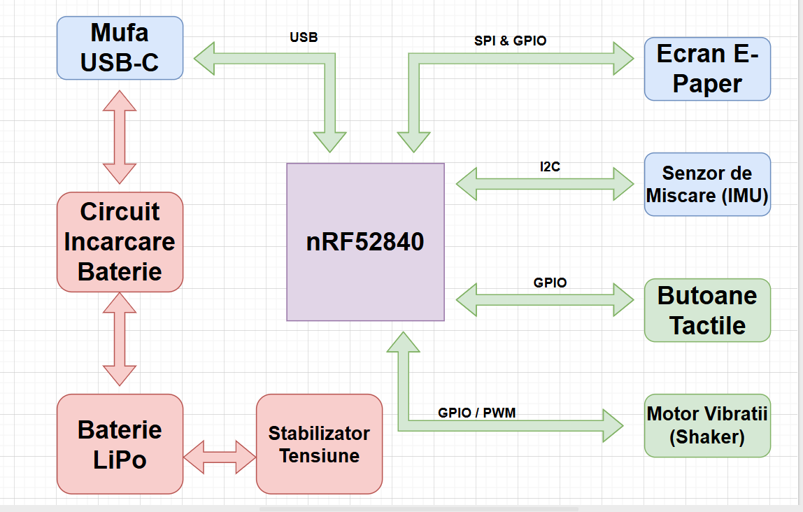

# Proiect InkTime - Smartwatch

Un smartwatch bazat pe microcontrollerul Nordic nRF52840 cu display e-Paper.

---

## Diagrama bloc

---

## Bill of Materials

| Ref | Componenta | Valoare | JLC Parts | Datasheet |
|-----|------------|---------|-----------|-----------|
| U1 | nRF52840 | $5.14 | [JLC](https://jlcpcb.com/parts/componentSearch?searchTxt=nRF52840-QF) | [DS](https://jlcpcb.com/api/file/downloadByFileSystemAccessId/8589839228197629952) |
| SWD | TC2030-IDC | $100.26 | [JLC](https://jlcpcb.com/partdetail/MicrochipTech-TC2030_CLIP3PACK/C5444772) | [DS](https://www.lcsc.com/datasheet/lcsc_datasheet_2403201318_Microchip-Tech-TC2030-CLIP-3PACK_C5444772.pdf) |
| ANT1 | 2450AT18B100E | $1.03 | [JLC](https://jlcpcb.com/partdetail/JohansonDielectrics-2450AT18B100E/C2917717) | [DS](https://jlcpcb.com/api/file/downloadByFileSystemAccessId/8588940948130156544) |
| X1 | NX2016SA-32MHZ-EXS00A-CS11336 | $9.04 | [JLC](https://jlcpcb.com/partdetail/NDK-NX2016SA_32MHZ_EXS00ACS11336/C6134317) | [DS](https://jlcpcb.com/api/file/downloadByFileSystemAccessId/8603064888214908928) |
| L2 | RC0402JR-070RL | $0.01 | [JLC](https://jlcpcb.com/partdetail/YAGEO-RC0402JR070RL/C60485) | [DS](https://jlcpcb.com/api/file/downloadByFileSystemAccessId/8717146932348461056) |
| L3 | RC0402JR-070RL | $0.01 | [JLC](https://jlcpcb.com/partdetail/YAGEO-RC0402JR070RL/C60485) | [DS](https://jlcpcb.com/api/file/downloadByFileSystemAccessId/8717146932348461056) |
| X2 | FC-135_32.7680KA-A3 | $0.2677 | [JLC](https://jlcpcb.com/partdetail/SeikoEpson-FC_135_32_7680KAA3/C2650472) | [DS](https://jlcpcb.com/partdetail/SeikoEpson-FC_135_32_7680KAA3/C2650472) |
| IC3 | BMA423 | $11.30 | [JLC](https://jlcpcb.com/partdetail/BoschSensortec-BMA423/C189517) | [DS](https://jlcpcb.com/api/file/downloadByFileSystemAccessId/8588894317147017216) |
| IC9 | RT6160 | $0.56 | [JLC](https://jlcpcb.com/partdetail/RichtekTech-RT6160AWSC/C7065276) | [DS](https://jlcpcb.com/api/file/downloadByFileSystemAccessId/8600398231234883584) |
| L7 | MLP2016SR47MT0S1 | $0.10 | [JLC](https://jlcpcb.com/partdetail/TDK-MLP2016SR47MT0S1/C87545) | [DS](https://jlcpcb.com/api/file/downloadByFileSystemAccessId/8588933367512879104) |
| IC1 | BQ25180YBGR | $2.01 | [JLC](https://jlcpcb.com/partdetail/TexasInstruments-BQ25180YBGR/C3682423) | [DS](https://www.ti.com/cn/lit/gpn/bq25180) |
| L5 | 744043680 | $9.53 | [JLC](https://jlcpcb.com/partdetail/WurthElektronik-744043680/C2045671) | [DS](https://www.we-online.com/components/products/datasheet/744043680.pdf) |
| D2 | MBR0530 | $0.03 | [JLC](https://jlcpcb.com/partdetail/78464-MBR0530/C77336) | [DS](https://jlcpcb.com/api/file/downloadByFileSystemAccessId/8586175081181818880) |
| D4 | MBR0530 | $0.03 | [JLC](https://jlcpcb.com/partdetail/78464-MBR0530/C77336) | [DS](https://jlcpcb.com/api/file/downloadByFileSystemAccessId/8586175081181818880) |
| D5 | MBR0530 | $0.03 | [JLC](https://jlcpcb.com/partdetail/78464-MBR0530/C77336) | [DS](https://jlcpcb.com/api/file/downloadByFileSystemAccessId/8586175081181818880) |
| Q3 | SI1308EDL-T1-GE3 | $0.18 | [JLC](https://jlcpcb.com/partdetail/VishayIntertech-SI1308EDL_T1GE3/C469327) | [DS](https://jlcpcb.com/api/file/downloadByFileSystemAccessId/8588884784742846464) |
| Q1 | DMG2305UX-7 | $0.10 | [JLC](https://jlcpcb.com/partdetail/DiodesIncorporated-DMG2305UX7/C150470) | [DS](https://jlcpcb.com/api/file/downloadByFileSystemAccessId/8560079443617075200) |
| IC2 | DRV2605YZFR | $1.31 | [JLC](https://jlcpcb.com/partdetail/TexasInstruments-DRV2605YZFR/C81079) | [DS](https://www.ti.com/cn/lit/gpn/drv2605) |
| D3 | USBLC6-2SC6Y | $0.24 | [JLC](https://jlcpcb.com/partdetail/STMicroelectronics-USBLC62SC6Y/C2969755) | [DS](https://jlcpcb.com/api/file/downloadByFileSystemAccessId/8603165824304111616) |
| J4 | KH-TYPE-C-16P | $0.08 | [JLC](https://jlcpcb.com/partdetail/Shenzhen_KinghelmElec-KH_TYPE_C16P/C709357) | [DS](https://jlcpcb.com/api/file/downloadByFileSystemAccessId/8588905154556923904) |
| U3 | MAX17048G-T10 | $2.44 | [JLC](https://jlcpcb.com/partdetail/2777647-MAX17048GT10/C2682616) | [DS](https://jlcpcb.com/api/file/downloadByFileSystemAccessId/8588907428524003328) |
| J1 | 503480-2400 | $0.84 | [JLC](https://jlcpcb.com/partdetail/MOLEX-5034802400/C122434) | [DS](https://www.molex.com/content/dam/molex/molex-dot-com/products/automated/en-us/salesdrawingpdf/503/503480/5034802400_sd.pdf?inline)
